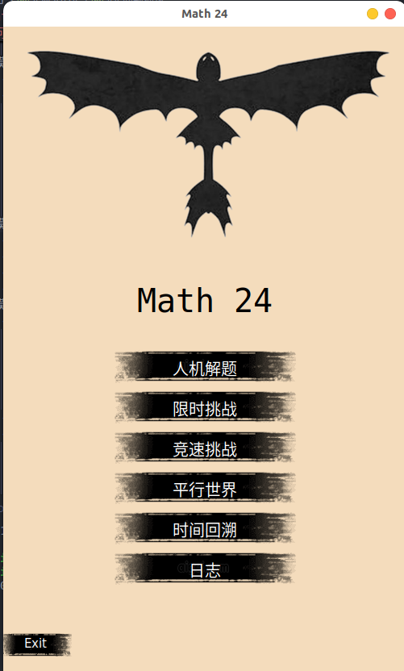
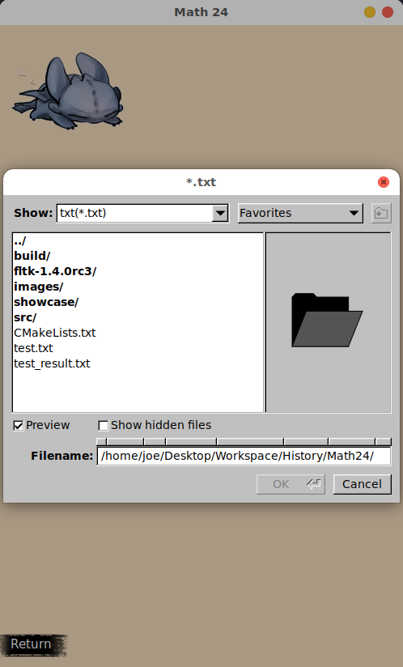
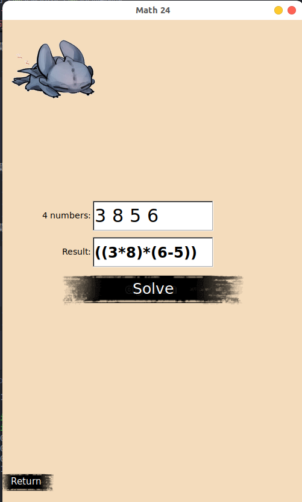
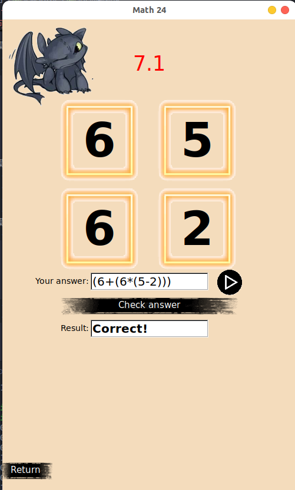
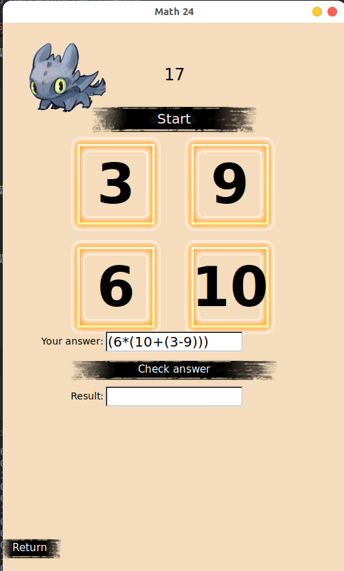
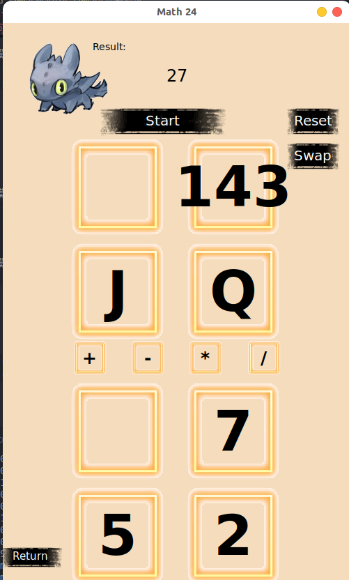
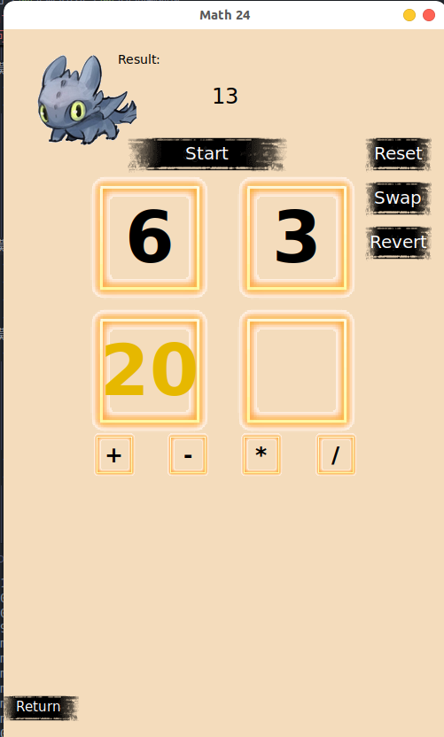
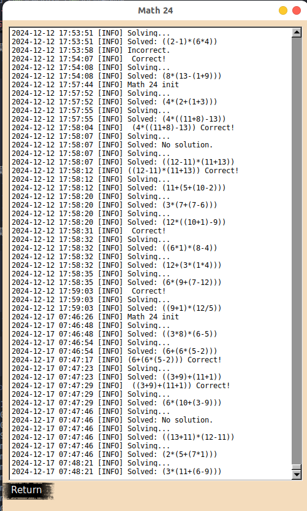

# Math24
“算24点”游戏规则如下：一副牌中抽去大小王剩下52张，将J、Q、K视作11、12、13。任意抽取4张牌，每张牌用一次按任意顺序用加、减、乘、除把牌面上的数算成24。先算出来的玩家获胜。

## 问题描述
设计有如下功能的游戏：
1. 模式一 人机解题
    - 点击"Load File"按钮，从文件中读取题目，并按照要求保存结果在"\<name\>_result.txt"文件中；
    - 
    - 获取四个数字或者J、Q、K，判断这四个数字是否可以算出24；
    - 样例1
        - 在"4 numbers"输入框输入8 9 J 5， 点击"Slove"按钮
        - Result文本框显示 (9+(5*(11-8)))
    - 样例2
        - 在"4 numbers"输入框输入7 7 4 9， 点击"Slove"按钮
        - Result文本框显示 No solution.
    - 

2. 模式二 限时挑战
    - 设定时间限制为**30s**，玩家需要在规定时间内算出24点，结果正确则玩家胜利，否则人机胜利。程序会保证给出的题面是可解的。
    - 样例1
        - 点击开始按钮（向右的小三角），4个金色框内显示可以使用的数字：3 9 2 10，并开始从30s倒计时
        - 当倒计时即将结束，倒计时会变成红色（剩12s），并放大字体（剩8s），提示玩家注意时间
        - 当玩家输入(10+(2+(3+9)))，点击"Check answer"按钮，Result文本框显示"Correct!"
        - 当玩家输入有误
            - 给出的式子没有按要求使用给出的4个数字，Result文本框显示"Invalid input."
            - 给出的式子算出答案不等于24，Result文本框显示"Incorrect.."
        - 当倒计时结束，游戏结束，显示程序给出的正确答案。
    - 
3. 模式三 竞速挑战
    - 连续完成**10**题24点，记录完成时间，用时最短的玩家获胜
    - 点击开始按钮，开始正计时，题面显示在4个金色框中，将式子输入到Your anwser文本框中，点击Check answer按钮，如果答案正确，则自动进入下一题，否则继续本题
    - 当做完10题，会记录完成时间，更新历史排名
    - 如果没有思路，可以点击Hint按钮，会提示可行解最后一步的式子，例如72/3
    - 
4. 模式四 平行世界
    - 引入新的解24点的交互方式，4个框以及4个运算符可以被选中：
        - 每一步都是二元运算，先点击运算符，再点击两个数字，或者先点第一个数字，再点运算符，最后点第二个数字；
        - 两个框会合并，显示数字变成了二元运算的结果
        - 执行3次运算后，结果会显示在最后一个框中，如果是24，则玩家成功
        - 如果误操作，可以点击Reset按钮，重新开始
        - 如果要调换某个题目中的数字顺序，可以点击Swap按钮，再点击两个数字，则会交换两个数字的位置
    - 平行世界是指同时给出两道题目，对于每一步执行如上合并时，会同时操作两个题目，对应位置的数字会被合并，目标是将两个题目都合并成24。
    - 样例1
        - 题目1: 7 10 7 5
        - 题目2: 8 12 4 5
        - 可行的解法如下, \<i> 表示题目中第i个数字：
             |步骤|运算式|题目1    |题目2    |
             |:---:|:---:|:---:|:---:|
             |第一步|<1> - **<4>**|   7-5=2 |   8-5=3|
             |第二步|**<4>** * <3>|  2\*7=14 |  3\*4=12|
             |第三步|<3> + <2>| 14+10=24 | 12+12=24|
    - 
5. 模式五 时间回溯
    - 时间回溯模式同样使用新的交互方式，但是目标数字可能是1到100中的某个数字，每一局会随机生成并显示在界面中
    - 为了合成到目标数字，标准的合并操作可能无法完成，这个模式提供一种特殊技能——时间回溯，可以回退到历史的某一步，并继续合并，直到合成目标数字。
    - 时间回溯的使用次数对于每局来说有限额
    - 如果仅仅是回退，不会改变历史进程，仍然无解；但是某一个或几个金色框具有时间领主的庇护，在时间回溯的过程中，不会回退，而是保持当前状态。
    - 样例1
        - 题目：7 **12** 8 10 目标数字 95, 第2位数字无视时间回溯，限制使用1次技能
        - 解法：
             |步骤|运算式|剩余数字
             |:---:|:---:|:---:|
             |第一步|<1> + <2> = 19|< > **19** 8 10|
             |第二步|时间回溯到第一步前|7 **19** 8 10|
             |第三步|<4> - <3> = 2|7 **19** 2 < > |
             |第四步|<1> - <3> = 5|< > **19** 5 < >|
             |第五步|<2> * <3> = 95|< > < > 95 < >|
    - 
6. 日志显示
    - 记录每局游戏的结果，包括题面、玩家的算式、时间、是否正确、程序给出的解答等。
    - 记录格式："YYYY-MM-DD HH:MM:SS [\<level>\] <log_message>"，其中level为日志级别，log_message为日志信息。
    - 日志级别：INFO、WARNING、ERROR、DEBUG
    - 日志文件保存在app.log文件中，不覆盖之前的日志。
    - 日志信息样例
        - 程序解答
            - 题目可解：2024-12-12 00:47:48 [INFO] Solved: (12+((11+13)/2))
            - 题目不可解：2024-12-12 02:24:01 [INFO] Solved: No solution.
        - 玩家解答
            - 正确：2024-12-12 08:56:09 [INFO]  13+9+7-5 Correct!
            - 错误：2024-12-12 10:55:51 [INFO] 10-6+9*2 Incorrect.
    - 
<!-- （2）读取文件，为文件中每一行的四个数字计算24；
（3）后续可能有的扩展需求（包含界面、表达式、对战等需求）；
（4）少量的测试用例；
（5）通过描述或者草图，将应用具体化；
（6）核心算法的文字描述，可能需要的库或者类的支持等。 -->

